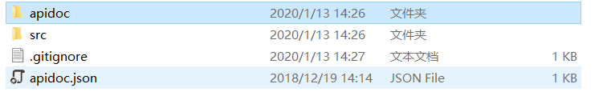
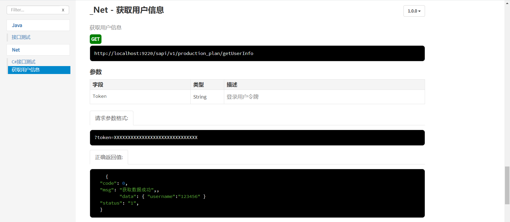

#  ApiDoc使用参考

## 安装
1. 安装node.js
2. 安装apiDoc

## 配置
在你的项目根目录下新建apidoc.json文件，该文件描述了项目对外提供接口的概要信息如名称、版本、描述、文档打开时浏览器显示标题和接口缺省访问地址。
``` 
{
  "name": "ServiceEbikeAPIs",
  "version": "3.1.0",
  "description": "车辆服务接口文档",
  "title": "ServiceEbikeAPIs",
  "url" : "http://cjl3.rokyinfo.net:7190/api-ebike"
}
```

## 使用样例
```
/**
 * @api {get} /test 接口测试
 * @apiDescription 根据ID（id）获取列表信息
 * @apiGroup Java
 *
 * @apiParam {Number} id 任务ID
 * @apiParam {Number} [page] 页数
 * @apiParam {Number} [perpage] 每页的条数
 *
 * @apiParamExample {string} 请求参数格式:
 *    ?id=123&page=1&perpage=20
 *
 * @apiVersion 1.0.0
 * @apiErrorExample {json} 错误返回值:
 *     {
 *        "code": 10003,
 *        "msg": "ParametersError [Method]:get_tests参数错误!",
 *        "error": {
 *            "id": "",
 *            "page": "",
 *            "perpage": ""
 *        },
 *       "status": "fail"
 *     }
 * @apiSuccessExample {json} 正确返回值:
 *     {
 *   "code": 0,
 *   "msg": "OK ",
 *   "data": [
 *       {
 *           "id": "622051004185471233",
 *           "testCode": "000050",
 *       }
 *   ],
 *   "status": "ok",
 *   "count": "14"
 *   }
 */
 public string test(int id , int page, int perpage)
 {
 	...
 }
```

## 本文Net示例 src/Net_ApiTest.cs
```
/**
  * @api {get} /getUserInfo 获取用户信息
  * @apiDescription 获取用户信息
  * @apiGroup .Net
  *
  * @apiParam {String} Token 登录用户令牌
  *
  * @apiParamExample {string} 请求参数格式:
  *    ?token=XXXXXXXXXXXXXXXXXXXXXXXXXXXXXX
  *
  * @apiVersion 1.0.0
  * @apiErrorExample {json} 错误返回值:
  *     {
  *        "code": 10003,
  *        "msg": "令牌验证异常!", 
  *        "status": "fail"
  *     }
  * @apiSuccessExample {json} 正确返回值:
  *     {
  *   "code": 0,
  *   "msg": "获取数据成功",,
  * 	 "data": { "username":"123456" }		 
  *   "status": "1",
  *   }
  */
  public string getUserInfo(string name , string pwd)
  {
      return "";
  }
```


参考官方文档[http://apidocjs.com](http://apidocjs.com/)


## 生成文档
cd到apidoc.json所在路径（即项目根目录）执行如下命令即可
> apidoc -i src/ -o apidoc/
> 

执行成功后会生成apidoc文件夹，打开运行index.html即可




## 运行

